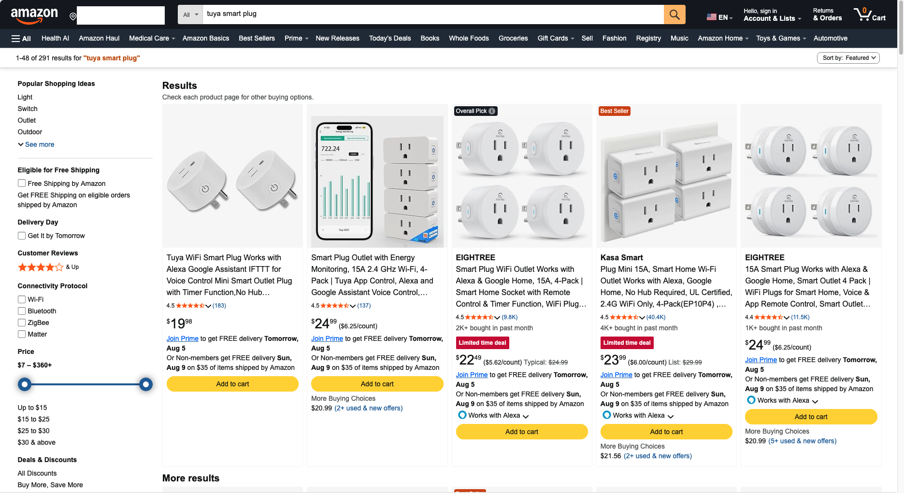

 Basic Information
Name: Kasa Smart Wi-Fi Plug Mini
Model: EP10P2
S/N: Y264328X03277
P/N: 0184600821
Wifi: 802.11b/g/n
FCC ID: 2AXJ4EP10
IC ID: 26583-EP10



# FCC ID Information
FCC ID: 2AXJ4EP10
Filing: https://fccid.io/2AXJ4EP10

# Internals
SoC: RTL8710CF

## UART Pins
Power pins are P1, P2, P3.
TP1, TP2, TP3, TP4, TP5, TP6 pins are also available.

Ground: TP1, P3

Voltages:
P1: 1.9 V
P2: 0 V
P3: Ground
TP1: Ground
TP2: 4.5 V
TP3: 1.6 V
TP4: 4.9 V
TP5: 1.6 V
TP6: 1.6 V

# Findings
- App will not use user CAs (requires patching).
- TPs seem very inconsistent, logic analyzer is needed to decode protocol.
- Using logic analyzer while plug is connected is risky. Desolder wifi board first and power with 3.3 V instead.

# API Prodding
 
Request: GET /v2/things?page=0&pageSize=500&deviceTypes=IOT.SMARTPLUGSWITCH%2CIOT.SMARTBULB%2CIOT.IPCAMERA%2CIOT.HUB%2CIOT.RANGEEXTENDER%2CIOT.RANGEEXTENDER.SMARTPLUG%2CIOT.ROUTER%2CSMART.KASAHUB%2CSMART.KASAENERGY%2CSMART.KASAPLUG%2CSMART.KASASWITCH%2CSMART.TAPOSENSOR

Response:
```json
{"thingName":"800697671ADBD01235F778F911F13ABE25A05801","appServerUrl":"https://use1-app-server.iot.i.tplinknbu.com","appServerUrlV2":"https://use1-app-server.iot.i.tplinkcloud.com","pcAppServerUrl":"https://n-use1-wap.tplinkcloud.com","pcAppServerUrlV2":"https://n-use1-wap.i.tplinkcloud.com","status":1,"thingModelId":"kasa:plug:v2","role":0,"authType":0,"shareType":"","familyId":"default1","roomId":"3QV0771Y","commonDevice":true,"commonDeviceV2":false,"nickname":"SFVNUFRZRFVN","avatarUrl":"","onboardingTime":1786735691,"category":"plug","model":"EP10(US)","crossRegion":true,"deviceName":"Smart Wi-Fi Plug Mini","deviceType":"IOT.SMARTPLUGSWITCH","oemId":"41372DE62C896B2C0E93C20D70B62DDB","hwId":"AE6865C67F6A54B756C0B5812472C825","hwVer":"1.0","fwVer":"1.0.5 Build 221021 Rel.183404","fwId":"00000000000000000000000000000000","region":"America/New_York","mac":"58D81223C8BA","isSubThing":false}
```
